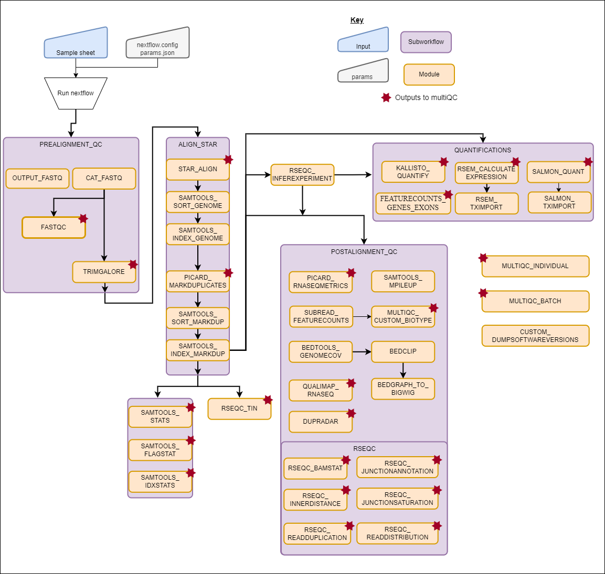

# RNA-seq pipeline
## Verion 1.0, March 2022
## Sam Humphrey

## Introduction

This pipeline is developed for the analysis of RNA-seq data with extensive adaptation from the [nf-core/rnaseq pipeline](https://nf-co.re/rnaseq/). 

The pipeline is built using [Nextflow](https://www.nextflow.io), specifically [Nextflow DSL2](https://www.nextflow.io/docs/latest/dsl2.html), a workflow tool to run tasks across multiple compute infrastructures in a very portable manner. It uses a Docker container making installation trivial and results highly reproducible.

## RNA-seq pipeline inputs

### Samplesheet

The samplesheet must be a csv file including the header, example:

```
sample_id,cellline_id,fastq_1,fastq_2
sample_1_rep1,sample_1,<s3_path_to_fastqs>sample_1_rep1_R1.fastq.gz,<s3_path_to_fastqs>sample_1_rep1_R2.fastq.gz
sample_1_rep2,sample_1,<s3_path_to_fastqs>sample_1_rep2_R1.fastq.gz,<s3_path_to_fastqs>sample_1_rep2_R2.fastq.gz
sample_2_rep1,sample_2,<s3_path_to_fastqs>sample_2_rep1_R1.fastq.gz,<s3_path_to_fastqs>sample_2_rep1_R2.fastq.gz
sample_2_rep2,sample_2,<s3_path_to_fastqs>sample_2_rep2_R1.fastq.gz,<s3_path_to_fastqs>sample_2_rep2_R2.fastq.gz
```
If samples from the same libraries are run on separate lanes of the sequencer (as above) these should just be added into the samplesheet as two separate entries with the same ngs_id and ptx_id. The pipeline will automatically add merge these fastq files together

A test samplesheet is in the code directory for the pipelines

### Parameters file

The parameters file is just a json containing some details that may change between runs
```
{
    "jobname":"RNAseq_test",
    "input":"<path_to_samplesheet>test_samplesheet.csv",
    "bucket":"s3://<output_directory>"
}
```

The output will be generated as `<date>_<jobname>` and the work directory with `<date>_work_<jobname>`
The work directory is coded in the config to run in `s3://<output_directory>`

A test params file is in the code directory for the pipelines


## Running the RNA-seq pipeline

1. Clone the codes from [`rnaseq_nextflow`](https://github.com/SamSticksHumphrey/RNAseq_NF.git)
2. Edit the nextflow.config to run the pipeline though the correct compute environment, and edit other parameters
3. Create a directory to run the pipeline in and cd into it
4. Copy the run-specific parameters file and samplesheet to the running directory
5. Edit the params file with the jobname and name of the samplesheet
6. Start a tmux session
7. Activate the conda environment
n8. Then run: `nextflow run <path_to_ngs-pipelines>/ngs-pipelines/rnaseq/rnaseq.nf -profile awsbatch -params-file params.json`

Leave it till it finishes, you can leave the tmux session, but don't turn off the EC2!

## Pipeline Structure



The `docker` folder contains the dockerfile required to build the image/container with the required software to run this pipeline. The `nextflow.config` file allows for changes to pipeline parameters as well as the output file locations. The input file must be specified as a command line argument.

### Module Structure

1. Pre-Alignment QC
  1. Samplesheet check to ensure all files
  2. Merge re-sequenced FastQ files ([`cat`](http://www.linfo.org/cat.html))
  3. Read QC ([`FastQC`](https://www.bioinformatics.babraham.ac.uk/projects/fastqc/))
  4. Adapter and quality trimming ([`Trim Galore!`](https://www.bioinformatics.babraham.ac.uk/projects/trim_galore/))

2. Align Star
  1. Genomic and Transcriptomic alignment [`STAR`](https://github.com/alexdobin/STAR)
  2. Sort and index alignments ([`SAMtools`](https://sourceforge.net/projects/samtools/files/samtools/))
  3. Duplicate read marking ([`picard MarkDuplicates`](https://broadinstitute.github.io/picard/))
  4. Sort and index alignments ([`SAMtools`](https://sourceforge.net/projects/samtools/files/samtools/))
  5.  ([`SAMtools`](https://sourceforge.net/projects/samtools/files/samtools/)) alignment Stats: stats, idxstats and flagstats

3. Quantifications
  1. [`Salmon`](https://combine-lab.github.io/salmon/) transcript quantifications and tximport to gene summarised counts from STAR aligned BAM
  2. [`RSEM`](https://github.com/deweylab/RSEM) transcript quantification and isoform prediction from STAR aligned bam
  3. [`Kallisto`](https://Kallisto) Transcript quantification from fastq

4. Post-Alignment QC
  1. [`BEDTools`](https://github.com/arq5x/bedtools2/), [`bedGraphToBigWig`](http://hgdownload.soe.ucsc.edu/admin/exe/) Create bigWig coverage files
  2. [`RSeQC`](http://rseqc.sourceforge.net/)
  3. [`Qualimap`](http://qualimap.bioinfo.cipf.es/)
  4. [`dupRadar`](https://bioconductor.org/packages/release/bioc/html/dupRadar.html)
  5. [`FeatureCounts Biotypes`](https://featurecounts.com)
  6. [`FeatureCounts genes exons`](https://featurecounts.com) Counts reads both gene-wise and exon-wise
  7. [`NGSCheckMate `](https://github.com/parklab/NGSCheckMate), [`Samtools mpileup`](http://www.htslib.org/doc/samtools-mpileup.html) Runs samtools mpileup across the NGScheckMate snp bed file
  8. [`picard RNAseq metrics`](https://gatk.broadinstitute.org/hc/en-us/articles/360037057492-CollectRnaSeqMetrics-Picard-) Collects RNAseq metrics
  
5. Multiqc
  Both Individual and batch multiQC output. Present QC for raw read, alignment, gene biotype, sample similarity, and strand-specificity checks ([`MultiQC`](http://multiqc.info/), [`R`](https://www.r-project.org/))
